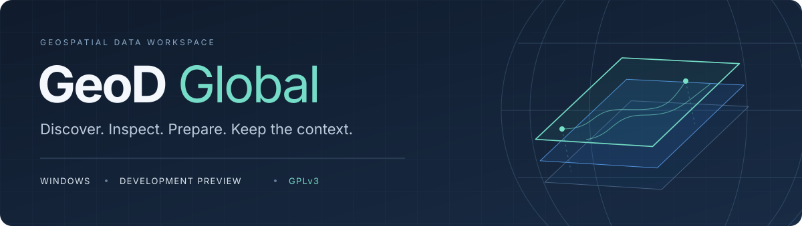
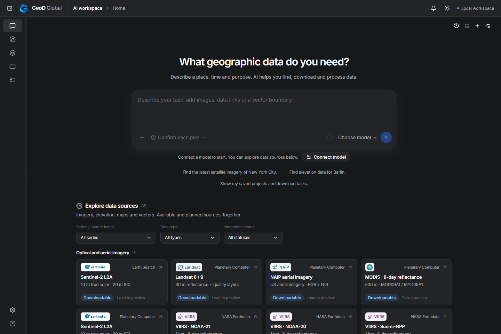
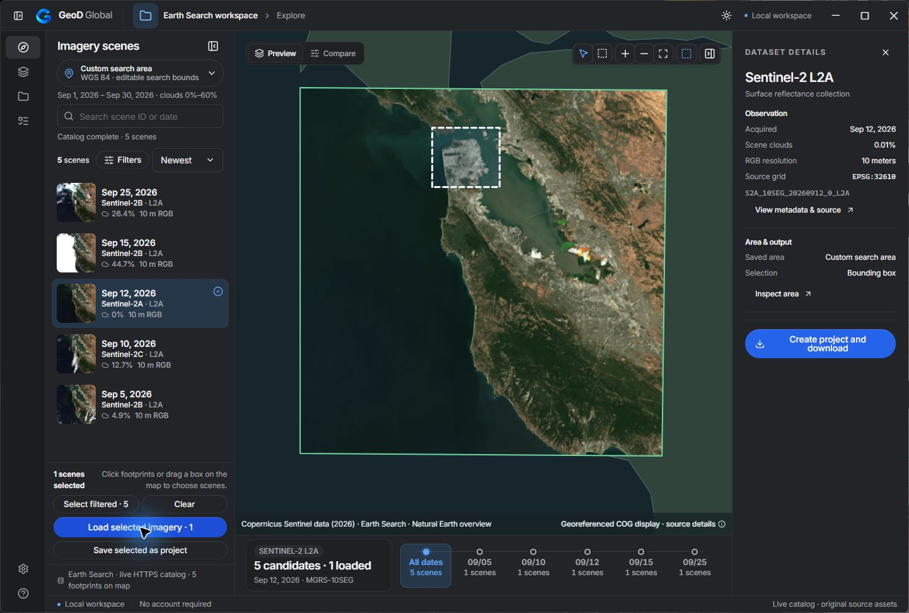
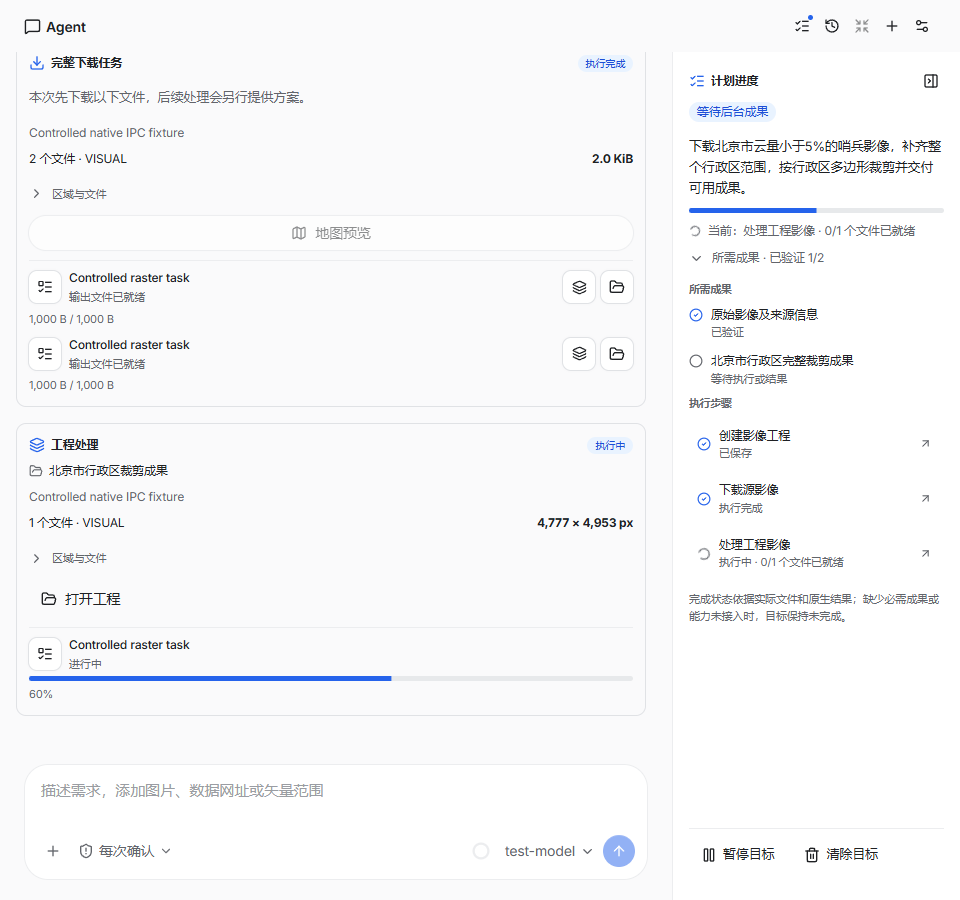
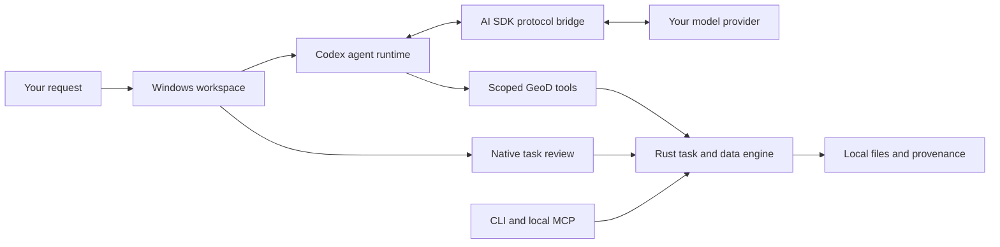

<div align="center">



### Describe the place. Review the plan. Keep the data.

An AI-assisted Windows workspace for finding, downloading and preparing **2D geospatial data**.

[](src-tauri/README.md) [](docs/development-preview.md) [](LICENSE) [](https://github.com/gaopengbin/geod-global/actions/workflows/check.yml)

**[Quick start](#quick-start)** · **[Data sources](#a-growing-2d-data-directory)** · **[Agent architecture](docs/agent.md)** · **[Releases](https://github.com/gaopengbin/geod-global/releases)** · **[Feedback](https://github.com/gaopengbin/geod-global/issues)**

English · [简体中文](README.zh-CN.md)

</div>



<sub>Current development frontend, October 7, 2026. Captured with an empty controlled workspace; no model request or download is represented. [Visual provenance](docs/images/README.md).</sub>

## From a request to a local result

Ask for a place, time range and intended output. GeoD helps resolve the area, discover supported products, preview the selected scenes and prepare a complete task for review. Downloads and supported processing run in the local Rust engine; results retain their source identity and checksums.

> “Find recent Sentinel-2 imagery for Beijing, with scene cloud cover below 5%, cover the administrative area and crop the result to its boundary.”

| Describe & clarify | Preview & review | Execute & inspect |
| :--- | :--- | :--- |
| Natural-language dialogue, streaming replies, model connections and option cards for decisions. | Administrative polygons, a right-side map preview with multiple scenes, and complete task cards. | Persistent local jobs, compatible-grid crop/mosaic, source-pixel inspection and documented export paths. |

When a goal is set, a side panel tracks its steps, pending decisions, jobs and verified outputs. By default, the user confirms the complete task before execution. An explicit automatic-execution preference is handled through the native permission policy. Completion follows settled jobs and validated files, rather than the model's wording.

[Goal workflow](docs/agent-goals.md) · [Decision cards](docs/agent-conversation.md) · [Area and coverage checks](docs/agent-area-coverage.md) · [Map preview](docs/agent-map-preview.md)

## A growing 2D data directory

**85 entries · 16 product/connection groups · 48 pending integration.** The directory includes concrete products, service connections and local file formats. These are different capabilities: a supported protocol does not make every dataset on a platform available.

| Product family | Current development scope |
| :--- | :--- |
| **Optical & aerial** | Sentinel-2 L2A through Earth Search / Planetary Computer, Landsat 8/9, MODIS reflectance and US NAIP. Product-specific file and processing evidence is documented. |
| **SAR & elevation** | Sentinel-1 IW RTC VV/VH/HH/HV; public Copernicus DEM GLO-30 / GLO-90. Formats, grids and units remain product-specific. |
| **Vegetation & quality** | MODIS NDVI/EVI and supporting science layers; documented Landsat/MODIS quality screening and scientific RGB. |
| **Protected products** | NASA HLS, SRTM and VIIRS, plus Copernicus Sentinel-2 SAFE: public catalog and authorization flows; production original-file acceptance still requires real-account verification. |
| **Services & local data** | STAC, COG/GeoTIFF URLs, WCS, WMS/WMTS/XYZ/TMS, ArcGIS, OGC API Features, WFS, bounded Overpass, PMTiles and supported local vector/tile files. |
| **Research candidates** | 35 new candidates: CBERS, disaster open imagery, EnMAP, land cover, water, forests, population, soil, climate, buildings and administrative boundaries. All marked **pending integration**. |

The compact cards group imagery, radar, elevation, land cover, water, population and other products while keeping the provider and access conditions visible. Grid columns adapt to the available panel width.

[Full source directory and scope](docs/product-scope.md) · [Integration status](docs/provider-integration-status.md) · [Open-data research CSV](docs/research/open-data-sources-2026-10-07.csv)

“Open” may mean public download, registration, a research application or limited samples. A 1 m classified map is not 1 m original RGB imagery; disaster open data is not a free global on-demand archive. The product scope is **2D**, including elevation rasters; 3D models and point clouds are outside the current plan.

<details>
<summary><strong>Map workspace and task progress</strong></summary>



<sub>Real native Windows capture, September 30, 2026; remote imagery preview. Copernicus Sentinel data (2026), Earth Search and Natural Earth overview. It predates the current Agent interface and is not evidence of completed download.</sub>



<sub>Development UI acceptance capture using controlled task state. Demonstrates layout and navigation, not a live acquisition. [Verification record](prototype/qa/agent-plan-sidebar-verification.json).</sub>

</details>

## One native core, several interfaces



Codex owns the Agent loop; the AI SDK adapts the selected model protocol. Native GeoD tools handle geographic queries, plans and file operations. Desktop, CLI and local MCP share the Rust core. Model credentials use the Windows credential vault, with separate histories for each connection. The workspace runs locally; conversations and selected attachments still contact the configured model provider, and data requests contact their providers.

[Agent implementation and acceptance](docs/agent-integration-status.md) · [CLI/MCP setup](docs/mcp.md) · [Attachments](docs/agent-documents.md)

## Quick start

The current Agent experience is in **source development**. The published [v0.1.0-rc.3 Windows candidate](https://github.com/gaopengbin/geod-global/releases/tag/v0.1.0-rc.3) predates these changes and does not include the new Agent. This source update does not publish a new installer.

For the native app, use **Windows x64**, Node.js **22.13+**, npm **10+**, Rust **1.91.1+**, Visual Studio C++ Build Tools and WebView2. From the repository root:

```sh
git clone https://github.com/gaopengbin/geod-global.git
cd geod-global
npm ci
npm run agent:prepare
npm run desktop:dev
```

`agent:prepare` prepares the pinned Windows Node/Codex runtime and its license inventory. Connect your model in the app; start with a place and a task. See [desktop setup](src-tauri/README.md) and [development guide](docs/development-guide.md).

<details>
<summary><strong>Browser preview, builds and checks</strong></summary>

```sh
# Browser UI at http://127.0.0.1:4317/
npm run dev

# Optional browser companion at http://127.0.0.1:4318/
npm run runtime

# Embedded debug desktop; no installer
npm run desktop:build

# Python 3.12 dependencies for contract/fixture checks
python -m pip install -r requirements-dev.txt
npm run verify:all
```

The in-app Agent and secure model setup require the native Windows application. A browser preview is not a substitute for desktop capability acceptance. Test fixtures, controlled UI captures and live data evidence are recorded separately.

</details>

## Development status

Update controls and the notification center are implemented in development. The independent signed production channel awaits a new signed release; development builds do not install updates. [Updates and size audit](docs/software-updates.md).

Supported crop/mosaic and science workflows have product and grid limits. General reprojection, arbitrary cross-grid processing, additional adapters, protected production originals and clean-machine release acceptance remain separate work. [Current limitations](docs/provider-integration-status.md) · [Latest local development notes](docs/development-preview.md).

## Documentation & contributions

| Start here | Explore further |
| :--- | :--- |
| [Development setup](docs/development-guide.md) | [Product specification](GeoD-Global-Spec/00-README.md) |
| [Agent workflows](docs/agent.md) | [Processing and recipes](GeoD-Global-Spec/11-Executable-Processing-and-Recipes.md) |
| [SCL crop walkthrough](docs/workflows/clip-sentinel-scl.md) | [Windows packaging](docs/releases/windows-packaging.md) |
| [Data-provider evidence](docs/providers.md) | [Workspace and delivery](GeoD-Global-Spec/12-Workspace-Agent-and-Distribution.md) |

Have a real task or an open dataset to suggest? [Open an issue](https://github.com/gaopengbin/geod-global/issues) with the place, product, period and desired output. For a data source, include its official download entry, coverage and access terms. Keep credentials and private client data out of reports.

## License

First-party code is **[GPL-3.0-only](LICENSE)**, © 2026 Gao Pengbin. Commercial use is permitted under the GPL, with its source and distribution obligations. [Separate commercial permissions](COMMERCIAL-LICENSING.md) may be discussed. Third-party software, datasets, mission marks and other assets retain their own terms.

<div align="center"><sub>GeoD Global · Independent software by Gao Pengbin · Keep the data. Keep its context.</sub></div>
