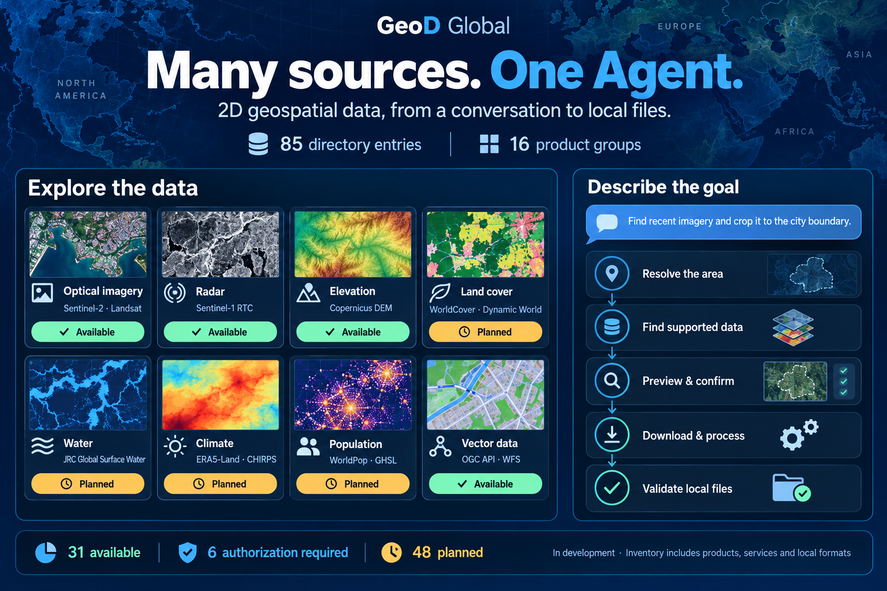
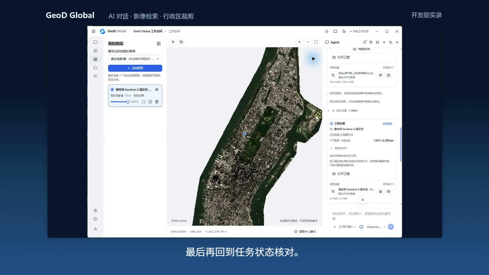
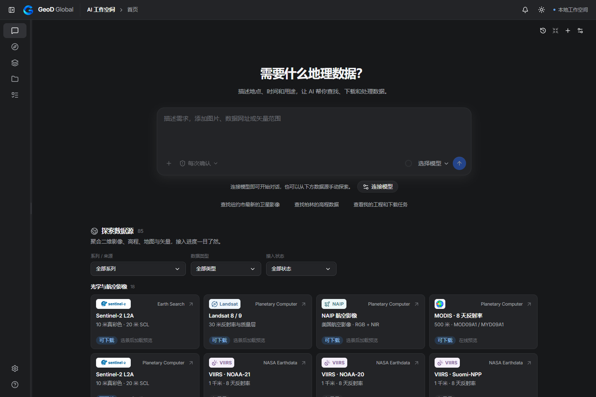
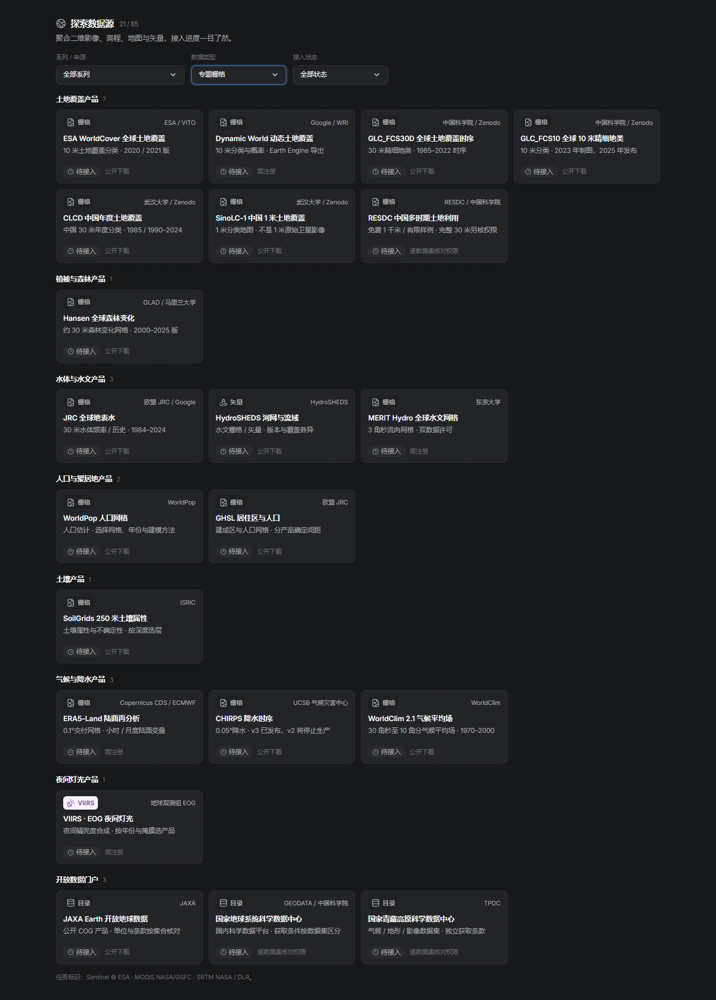
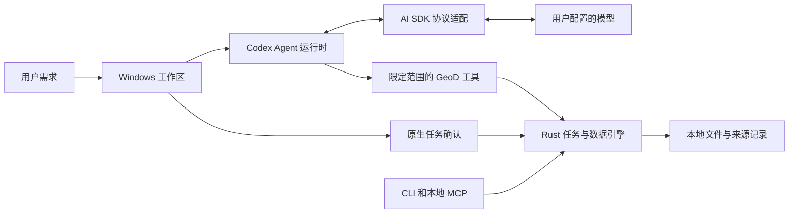

<div align="center">



### 丰富的数据源，目标驱动的 Agent。

在同一个 Windows 工作区里浏览丰富的 **二维数据目录**，用 **AI 对话**描述地点、时间和所需成果，让 Agent 准备可确认的下载与处理任务。

[](src-tauri/README.md) [](docs/development-preview.md) [](LICENSE) [](https://github.com/gaopengbin/geod-global/actions/workflows/check.yml)

**[快速开始](#快速开始)** · **[数据源](#持续扩充的二维数据目录)** · **[Agent 架构](docs/agent.md)** · **[发行版本](https://github.com/gaopengbin/geod-global/releases)** · **[反馈](https://github.com/gaopengbin/geod-global/issues)**

[English](README.md) · 简体中文

</div>

## 观看 Agent 完整实操

[](https://geod-global.laogao.xyz/zh/index.html#demo)

**[观看 3 分 10 秒完整演示](https://geod-global.laogao.xyz/zh/index.html#demo)**，中文配音与字幕。真实 Windows 开发版录屏：描述曼哈顿哨兵二号影像需求 → 检查行政区多边形与覆盖 → 确认任务 → 下载原文件 → 裁剪本地 GeoTIFF → 打开并核验这次新生成的成果。等待过程已压缩并标注。Copernicus Sentinel 数据（2026），通过 Earth Search 获取。

视频展示当前开发版，不代表发布了新安装包。[录屏来源](docs/images/README.md#agent-demo-20261009jpg)。

| **丰富的数据源聚合** | **围绕目标推进的 Agent** |
| :--- | :--- |
| **85 个入口、16 个分类**，涵盖卫星影像、地形、专题栅格、矢量、地图服务与本地文件。产品、供应平台、获取条件和接入状态分别展示。 | 自然语言描述需要的结果，**Codex 驱动的 Agent** 解析范围、检索支持的数据、通过选项卡询问决策，提交完整任务供确认，并跟踪本地任务直至文件校验。 |

<sub>亮点总览为产品说明图，地图缩略图为装饰示意。目录包含产品、服务连接和本地格式。**31 项已接入 · 6 项需授权 · 48 项待接入。** [图片来源与生成提示词](docs/images/README.md#agent-data-overviewpng)。</sub>



<sub>2026-10-07 当前开发界面，使用空的受控工作区状态拍摄，没有调用模型或开始下载。[截图来源](docs/images/README.md)。</sub>

## Agent 模式：从一句需求，到本地成果

告诉 GeoD 地点、时间和需要的结果。Agent 帮你确定范围、检索支持的数据、预览选中的影像，准备完整任务供审阅。下载和支持的处理流程由本地 Rust 引擎执行，结果保留源身份、处理记录和校验值。

> “找北京市近期的哨兵二号影像，场景云量小于 5%，覆盖完整行政区，并按行政区边界裁剪。”

| 描述与澄清 | 预览与审阅 | 执行与检查 |
| :--- | :--- | :--- |
| 自然语言对话、流式回复、模型连接，需要决策时提供选项卡。 | 行政区多边形、右侧多景地图预览，以及完整任务确认卡。 | 本地持久任务、兼容网格裁剪 / 拼接、原始像元检查和已有交付流程。 |

设定目标后，侧边计划面板跟踪步骤、待回答选项、任务状态和已校验成果。默认由用户在执行前确认完整任务；明确选择自动执行时，仍按原生权限策略处理。任务是否完成取决于实际任务收尾和文件校验。

[目标模式](docs/agent-goals.md) · [选项与对话](docs/agent-conversation.md) · [行政区及覆盖检查](docs/agent-area-coverage.md) · [地图预览](docs/agent-map-preview.md)

## 持续扩充的二维数据目录

**85 个入口 · 16 个产品 / 连接分类 · 48 项待接入。** 目录同时列出具体产品、服务连接和本地格式，分别显示能力与状态。支持某个协议，不代表该平台所有数据都已接入。

| 影像与地形 | 环境产品 | 专题与矢量产品 | 连接与文件 |
| :--- | :--- | :--- | :--- |
| 光学与航空影像 **18** | 土地覆盖 **7** | 人口与聚落 **2** | 离线地图归档 **1** |
| SAR 雷达影像 **2** | 植被与森林 **2** | 土壤 **1** | 栅格目录与覆盖服务 **8** |
| 高程与水深 **9** | 水体与水文 **3** | 夜间灯光 **1** | 本地二维文件 **7** |
| 地图影像与历史 **7** | 气候与降水 **3** | 矢量数据与服务 **9** | 公共数据门户 **5** |

<sub>统计来自当前[数据源目录](prototype/src/source-directory.js)，包括待接入项。四列仅方便阅读；每个列出的分类对应软件看板中的一个分组。</sub>

<details>
<summary><strong>展开真实数据源看板：8 个专题产品分类、21 个入口</strong></summary>



<sub>当前 SourceBoard 组件的本地截图，使用中文和专题栅格筛选。待接入项不能发起连接；截图过程未调用模型或数据提供商。[拍摄范围](docs/images/README.md#data-source-board-enpng--data-source-board-zh-cnpng)。</sub>

</details>

| 产品类别 | 当前开发范围 |
| :--- | :--- |
| **光学与航空影像** | Earth Search / Planetary Computer 的 Sentinel-2 L2A、Landsat 8/9、MODIS 反射率、美国 NAIP。原文件与处理能力按产品分别记录。 |
| **SAR 与高程** | Sentinel-1 IW RTC 的 VV/VH/HH/HV；公开 Copernicus DEM GLO-30 / GLO-90。格式、网格与单位逐产品核对。 |
| **植被与质量** | MODIS NDVI/EVI 及辅助科学层；已有 Landsat/MODIS 质量筛选和科学 RGB 流程。 |
| **受保护产品** | NASA HLS、SRTM、VIIRS，以及 Copernicus Sentinel-2 SAFE：已接公开目录和授权流程，生产原文件仍待真实账号验收。 |
| **服务与本地数据** | STAC、COG/GeoTIFF URL、WCS、WMS/WMTS/XYZ/TMS、ArcGIS、OGC API Features、WFS、有界 Overpass、PMTiles，以及支持的本地矢量 / 瓦片文件。 |
| **调研候选** | 新增 35 项：CBERS、灾害开放影像、EnMAP、土地覆盖、水体、森林、人口、土壤、气候、建筑和行政区等，全部明确标为 **待接入**。 |

紧凑卡片按光学、雷达、高程、土地覆盖、水文、人口等产品分类摆放，独立显示供应平台和获取条件，随面板宽度调整列数。

[完整范围与目录](docs/product-scope.md) · [接入状态](docs/provider-integration-status.md) · [开放数据调研表](docs/research/open-data-sources-2026-10-07.csv)

开放数据可能需要注册、科研申请，或仅开放有限样例。1 米分类图不能当作 1 米原始真彩色影像；灾害开放数据也不是全球按需免费影像库。当前只做 **二维**，包括高程栅格，不接入三维模型和点云。

<details>
<summary><strong>地图工作区与计划进度</strong></summary>


<sub>2026-09-30 真实 Windows 窗口截图，展示远程影像预览。来源为 Copernicus Sentinel data (2026)、Earth Search 和 Natural Earth，早于当前 Agent 界面，不作为下载完成证据。</sub>


<sub>使用受控任务状态的开发界面验收截图，展示布局和导航，不表示一次真实采集。[验证记录](prototype/qa/agent-plan-sidebar-verification.json)。</sub>

</details>

## 同一个原生核心，多种使用方式



Codex 负责 Agent 循环，AI SDK 适配所选模型协议，原生 GeoD 工具处理地理查询、计划和文件操作。桌面、CLI 与本地 MCP 共用 Rust 核心。模型密钥保存于 Windows 凭据管理器，每个连接保留独立历史。工作区在本地运行，对话与选中的附件仍会发送到所配置的模型服务，数据检索和下载会访问相应提供商。

[Agent 实现与验收](docs/agent-integration-status.md) · [CLI / MCP](docs/mcp.md) · [文档附件](docs/agent-documents.md)

## 快速开始

**[v0.2.0-rc.4 Windows 评估版](https://github.com/gaopengbin/geod-global/releases/tag/v0.2.0-rc.4)** 包含对话 Agent、数据源看板和 Global 独立账号入口，提供便携 ZIP 与当前用户安装包。它是未签名预发布版，具体范围和验收缺口见[发行记录](docs/releases/0.2.0-rc.4.md)。旧 rc.3 早于 Agent 接入。

桌面开发需要 **Windows x64**、Node.js **22.13+**、npm **10+**、Rust **1.91.1+**、Visual Studio C++ Build Tools 和 WebView2。在仓库根目录运行：

```sh
git clone https://github.com/gaopengbin/geod-global.git
cd geod-global
npm ci
npm run agent:prepare
npm run desktop:dev
```

`agent:prepare` 准备固定版本的 Windows Node/Codex 运行环境及许可清单。在软件里连接模型，再描述地点和任务即可。详见[桌面环境](src-tauri/README.md)与[开发指南](docs/development-guide.zh-CN.md)。

<details>
<summary><strong>浏览器预览、构建与检查</strong></summary>

```sh
# 浏览器界面：http://127.0.0.1:4317/
npm run dev

# 可选浏览器配套服务：http://127.0.0.1:4318/
npm run runtime

# 嵌入界面的调试程序，不制作安装包
npm run desktop:build

# 契约 / 夹具检查需要 Python 3.12
python -m pip install -r requirements-dev.txt
npm run verify:all
```

软件内 Agent 与安全模型配置需要原生 Windows 程序。浏览器预览不能替代桌面能力验收；夹具、受控界面截图与真实数据验证分别记录。

</details>

## 开发进度

开发代码已加入软件更新和通知中心，独立签名生产渠道待新签名版本发布，开发版不安装更新。[更新与安装体积核对](docs/software-updates.md)。

已有裁剪、拼接和科学处理按产品与网格限制执行。通用重投影、任意跨网格处理、更多数据适配、受保护生产原件与干净设备发行验收，分别作为后续工作。[能力与限制](docs/provider-integration-status.md) · [最新开发说明](docs/development-preview.md)。

## 文档与参与

| 从这里开始 | 深入了解 |
| :--- | :--- |
| [开发环境](docs/development-guide.zh-CN.md) | [产品规格](GeoD-Global-Spec/00-README.md) |
| [Agent 工作流](docs/agent.md) | [处理与配方](GeoD-Global-Spec/11-Executable-Processing-and-Recipes.md) |
| [SCL 裁剪示例](docs/workflows/clip-sentinel-scl.md) | [Windows 打包](docs/releases/windows-packaging.md) |
| [数据源证据](docs/providers.md) | [工作区与成果交付](GeoD-Global-Spec/12-Workspace-Agent-and-Distribution.md) |

有真实任务或开放数据源推荐，欢迎[创建 Issue](https://github.com/gaopengbin/geod-global/issues)，说明地点、产品、时间和需要的结果。推荐数据源时请附官方获取入口、覆盖范围和使用条件，省略密钥与私有客户数据。

## 许可

自有代码采用 **[GPL-3.0-only](LICENSE)**，© 2026 Gao Pengbin。允许按 GPL 商用，分发时须履行相应源码与许可义务。[独立商业许可](COMMERCIAL-LICENSING.md)可另行讨论。第三方软件、数据、任务标识和其他资产保留各自条款。

<div align="center"><sub>GeoD Global · Gao Pengbin 独立开发 · 留下数据，也留下来源。</sub></div>
