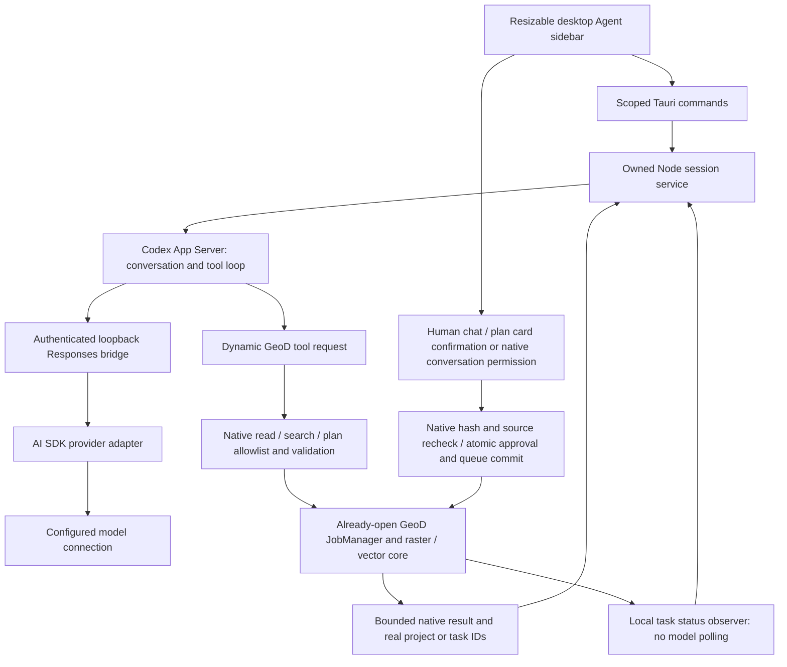

# Desktop Agent architecture and development acceptance

## Codex Goals on October 7

The owned pinned runtime now enables native Goals and uses `thread/goal/set`,
`thread/goal/get` and `thread/goal/clear`. GeoD persists a required-delivery
manifest and checks every bound native plan and file before marking the goal
complete. The final response boundary pauses native auto-continuation, leaving
the existing single workflow coordinator to await reviews/jobs and resume the
same Codex conversation. Private pause/resume/clear controls do not grant
execution permission. See [goal behavior and evidence](agent-goals.md).

This delivers bounded goal continuation and aggregate checks for existing native
outputs. Full semantic TaskRequest matching, long temporal batches and new
statistics remain outside this implementation; controlled checks are not live
model download acceptance.

## General task planning on October 7

Required human decisions now use the owned `geod_request_decision` conversation
action. It presents selectable cards, retains actual answers across restarts and
never calls the native download adapter or grants permission. Recommendations
are not preselected. The native data tool registry remains separate.

Downloads in the default confirmation mode show the effective request, recorded
choices and the actual immutable native plan: area, requested dates, source,
assets, size or unknown size, output and limitations. Unanswered decisions block
plan preparation and confirmation. Decisions answered after a review invalidate
its confirmation until a fresh or revised card includes them. Only explicit
private desktop permission enables automatic choices and execution. Choice
submission is never plan approval. See [conversation use](agent-conversation.md)
and [interaction verification](../prototype/qa/agent-decisions-verification.json).

The conversation service now adds the eight composable outcome classes in
[task-categories.mjs](../agent/task-categories.mjs) to its developer instructions
for new, resumed and compacted threads. They cover discovery, acquisition, spatial
preparation, temporal preparation, scientific processing, statistics, offline
delivery and inspection/recovery. Explicit user constraints, available native
operations, typed file receipts and native execution permissions remain
authoritative. These classes are guidance, not capability declarations or a new
executable task API.

The [general task specification](../GeoD-Global-Spec/15-General-Agent-Tasks.md)
defines the full request-level contract, capability matching, expected-output
manifest, batch recovery and aggregate completion work. Native delivery manifests
and aggregate artifact checks are now implemented as described above; complete
semantic matching and long batch recovery remain pending. The [research mapping](research/agent-task-classification-2026-10-07.json)
traces 61 independent demands to these classes without treating them as passed
acceptance. Targeted service/workflow tests cover instruction propagation and
existing permission/receipt boundaries; no new live model acquisition has been
performed for this change.

The in-app Agent is being implemented in the independent **GeoD Global** desktop
application. The existing [Codex / AI SDK evaluation](research/codex-ai-sdk-evaluation-2026-10-03.md)
is the architectural starting point; its external proof is reference material,
not an executable dependency. This document describes the implemented read and
acquisition and project processing integration on October 4–6, 2026. Conversation execution and automatic continuation are described in [the current natural-language workflow](agent-conversation.md); the default remains confirmation per plan. It is **not included in the published
v0.1.0-rc.3 installer or portable ZIP**.

## One orchestration loop, one business core



Codex owns the loop, streamed turn events, interruption and thread restoration.
AI SDK adapts the configured provider and has no `execute` callbacks, automatic
tool execution or second agent loop. Rust owns data access, validation and the
existing task lifecycle. The desktop Agent attaches to the application's
already-open `JobManager`; it does not open another runtime store or public
GeoD HTTP endpoint. The CLI and [MCP](mcp.md) continue to use the same core.

Pinned development versions:

| Component | Version | Owned source |
| --- | --- | --- |
| Codex App Server | 0.159.2 | Exact npm dependency and lockfile integrity |
| AI SDK | 7.0.127 | Root package and lockfile |
| OpenAI-compatible provider | 3.0.62 | Root package and lockfile |
| OpenAI Responses provider | 4.0.83 | Root package and lockfile |
| Anthropic Messages provider | 4.0.71 | Root package and lockfile |
| Google Generative AI provider | 4.0.87 | Root package and lockfile |
| Child Node runtime | 24.14.0, Windows x64 | Official Node download, pinned SHA-256 |

The bridge supports compatible Chat Completions, native OpenAI Responses,
Anthropic Messages and Google Generative AI. Codex remains the sole orchestration loop; SDK tools
have no execution callbacks. Reasoning is separate from the final answer. Native
signatures and Anthropic opaque thinking are saved in a bounded, private per-
conversation sidecar and restored only for matching content and connection
identity. That sidecar contains hashes and closed provider metadata, not prompts,
tool results or model keys. Missing, mismatched or ambiguous signatures fail
instead of silently dropping reasoning or injecting a Google bypass sentinel.
User-selected PNG, JPEG and WebP inputs now pass through owned native image
storage and Codex `localImage` input into SDK image file parts. Native manual and
automatic context organization retain app history, restore selected images and
keep native reviews separate; see [context organization](agent-context.md) for
actual evidence and storage limits. Native OpenAI encrypted reasoning now has
bounded, connection-scoped recovery with `store:false`; existing Chat Completions
connections keep their protocol. See [OpenAI Responses](agent-openai-responses.md).
UTF-8 text and bounded, unencrypted PDF / DOCX / XLSX / PPTX documents now have native ingestion, local preview and recovery; see [document attachments](agent-documents.md). PDF delivery preserves original bytes and depends on the selected model and endpoint. Office originals require Responses. Audio and video attachments are **deferred by the user and excluded from current Agent integration acceptance**. Existing partial code and historical records remain; no further formats, protocols, tests, live model calls or acceptance materials are planned for this deferred work. Legacy DOC / XLS / PPT and other Office formats remain unsupported. Attachment storage management is available
from conversation history; cleanup protects all conversation references and the current draft.
Protocol implementation is not evidence that a particular cloud
route is available; see [native protocol acceptance](../prototype/qa/agent-native-protocols-verification.json).

Native endpoint and authentication behavior follows the pinned SDK sources and
the [Anthropic](https://ai-sdk.dev/providers/ai-sdk-providers/anthropic) and
[Google](https://ai-sdk.dev/providers/ai-sdk-providers/google) provider references.

The integration follows the official [App Server protocol](https://learn.chatgpt.com/docs/app-server)
for experimental dynamic tools, turn interruption and persisted thread resume.
This is not a claim that every compatible provider or model supports the same
tool behavior.

The orchestration model is the private route `geod-text-tools`; the AI SDK sends
the actual selected remote model ID. This prevents a remote model's name from
selecting Codex's built-in code tools. Public model labels, connection identity
and persisted history retain the actual configured model. The bridge accepts
only its private route and the native pinned GeoD tool declarations, including
Responses Lite `additional_tools` in the default `functions` namespace. Native
schemas replace incoming schemas; built-in tools, other namespaces and opaque
encrypted function arguments cannot cross the bridge. Codex remains the sole loop.

## Implemented read tools

| Tool | Actual local action |
| --- | --- |
| `geod_health` | Read runtime health and ownership |
| `geod_projects_list` | List saved projects |
| `geod_project_get` | Read one saved project's metadata |
| `geod_jobs_list` | List actual jobs; optional native `projectId` scope before pagination, with fresh settlement |
| `geod_job_status` | Read status, settlement and available checksum |
| `geod_raster_inspect` | Verify a managed file and inspect its raster metadata |
| `geod_raster_pixel` | Read an original supported pixel |
| `geod_rgb_inspect` | Verify a managed scientific RGB file, raw band types, calibration and quality provenance |
| `geod_rgb_pixel` | Read the three original RGB values and their calibrated reflectance at one pixel |
| `geod_recipes_list` | List saved executable recipes |
| `geod_recipe_plan` | Validate and preflight a supplied recipe without running it |
| `geod_stac_connections` | Read summaries of custom sources already connected in the app |
| `geod_stac_catalog` | Page their archived real collections, static directory keys or standalone snapshot references |
| `geod_stac_snapshot` | Read a pinned custom Item's properties, geometry, time and collection declaration; explicit asset counts/paging hint replace the large asset array; source URLs/paths are excluded |
| `geod_stac_assets` | Page all original asset declarations and eligibility/reasons, including unsupported assets |
| `geod_stac_inspect` | Verify a completed custom TIFF, its native grid, sample types and declarations; omit PNG |
| `geod_stac_pixel` | Read original custom raster samples by zero-based column/row |
| `geod_feature_services` | Page saved OGC / ArcGIS / WFS / Overpass service metadata; no live availability claim |
| `geod_feature_collections` | Read saved native collection declarations for an actual service ID |
| `geod_vectors_list` | Page registered vector file summaries, explicitly unverified |
| `geod_vector_inspect` | Verify original vector bytes and the native conversion, with provenance and hashes |
| `geod_vector_features` | Verify and page original feature indices, identities and detail references |
| `geod_vector_node` | Read verified attribute / geometry nodes without simplification; page large values and mark Agent redaction |
| `geod_wcs_connections` / `geod_wcs_coverages` | Page saved coverage services and their advertised dataset IDs; metadata is not a live availability claim |
| `geod_wcs_description` / `geod_wcs_plan` | Read archived coverage declarations and the native grid request derived from their hashed XML |
| `geod_wcs_inspect` / `geod_wcs_pixel` | Verify a completed generated subset and read its original supported samples; declared units remain distinct from actual file tags |

## Search, plan review and execution

The implemented review tools use the same business core:

| Tool | Actual action |
| --- | --- |
| `geod_sources_list` | Read reviewed source adapters, product/date semantics and current native account status with fixed setup entry points |
| `geod_workspace_context` | Read the attached area, dates, source and project; polygon positions stay local and only their bounds/fingerprint reach the model |
| `geod_scene_search` | Query a bounded public catalog page from fifteen fixed provider/collection adapters |
| `geod_stac_search` | Search a saved custom API/static directory, archive native metadata and preserve continuation; no project or download |
| `geod_stac_project_plan` | Review archived original assets for a new project or append them while preserving the saved project area |
| `geod_stac_download_plan` | Review missing custom-project originals with size / strong ETag preflight and verified local reuse |
| `geod_wcs_describe` / `geod_wcs_prepare` | Discover metadata from an already saved service, then derive a native-grid request for explicit user WGS84 bounds; no project or download |
| `geod_wcs_project_plan` | Review saved coverage request references for a new project or append them while preserving the complete mixed project scope |
| `geod_wcs_download_plan` | Review missing coverage subsets; separate native confirmation queues real task IDs immediately, using the existing WCS download worker |
| `geod_download_plan` | Pin 1–32 returned scene assets, preflight sizes and strong ETags; no project or transfer yet |
| `geod_project_plan` | Review a new project or append returned scenes; preserve existing area/assets; optionally retain the attached native polygon in a new project |
| `geod_project_download_plan` | Review missing files in a saved project; reuse matching native active/completed tasks; one provider per plan |
| `geod_project_mosaic_plan` | Preflight settled local source checksums, original grid, saved area/mask, output dimensions and disk budget; optional MODIS VI quality selection |
| `geod_scientific_rgb_plan` | Review three settled original red/green/blue bands, optional matched Landsat/MODIS quality files, calibration, output grid and disk budget |
| `geod_clip_plan` | Preflight a rectangular WGS84 local SCL crop, optionally using the original attached native polygon |
| `geod_recipe_review_plan` | Review native v1 source/WGS84 rectangular or v2 WGS84 polygon SCL recipes |
| `geod_vector_extract_plan` | Review an already-saved vector service, native collection, bounds/polygon and metadata fingerprint; unknown counts remain unknown, no external extraction |
| `geod_plan_status` | Read original plan/task IDs, progress and settlement; never approve or retry |

There are **48 dynamic tools**, including the custom-source and WCS additions.
No business execution tool is exposed to the model. Vector reads and their
real public-data, model, restart and offline checks are described in
[Vector MCP / Agent integration](vector-agent.md). Vector extraction review, human
parameter correction and explicit native confirmation now use the same review path.
Confirmation persists one deterministic managed vector and its approval atomically;
repeated confirmation and restart reuse that verified result, without fake raster jobs.
The model cannot add a service or approve an extraction.

Reviewed public acquisition adapters:

| Source | Reviewed files | Query semantics |
| --- | --- | --- |
| Earth Search Sentinel-2 L2A | SCL, visual COG | Acquisition date, cloud maximum |
| Planetary Computer Sentinel-2 L2A | SCL, visual COG | Acquisition date, cloud maximum |
| Planetary Computer Landsat 8/9 L2 | Red/green/blue DN, QA_PIXEL, QA_RADSAT | Acquisition date, cloud maximum; original scale/offset retained |
| Planetary Computer Sentinel-1 IW RTC | VV/VH/HH/HV actually present in the product | Acquisition date; no optical cloud filter |
| Planetary Computer MODIS 09A1 v061 | Red/green/blue converted COGs, unsigned QC/state | Eight-day composite period; sinusoidal grid |
| Planetary Computer MODIS 13Q1 v061 | NDVI/EVI and ten native ancillary science layers | Sixteen-day composite period; original signed/unsigned types, units, fill and scale |
| Planetary Computer NAIP | Four-band RGB + NIR aerial COG | Acquisition date; no optical cloud filter |
| Copernicus DEM GLO-30 Public | Float32 elevation COG | Spatial query; catalog date is reference metadata, not acquisition |
| Copernicus DEM GLO-90 | Float32 elevation COG | Spatial query; catalog date is reference metadata, not acquisition |

Adapter support does not guarantee an upstream service will respond now. Search,
preview, provider COG and original sensor archive are separate representations.
The native Planetary Computer product/band checker is shared with downloads;
validated search pages can seed its bounded five-minute in-memory item cache.
Read-only SAS grants stay in runtime memory and never enter plans or saved jobs.
Plan approval still rechecks the actual file's strong ETag and byte count.

The six account-backed adapters below support public discovery, metadata-only
project reviews and protected download reviews through the same native engine.
They do not require an account to search or save a project. Original acquisition
requires authorization in Settings and a separate native card confirmation.

| Adapter | Reviewed native asset | Date semantics / output |
| --- | --- | --- |
| Copernicus Data Space Sentinel-2 L2A | Exact STAC product identity resolved through public OData to its original UUID | Acquisition / complete SAFE ZIP |
| NASA Earthdata HLS L30 v2 | B04 red, B03 green, B02 blue | Acquisition / original GeoTIFF per band |
| NASA Earthdata SRTMGL1 v003 | Exact geocell HGT archive | Reference date, no acquisition filter / HGT ZIP |
| NASA VIIRS Suomi-NPP VNP09A1 v002 | Exact production HDF5 | Eight-day composite / HDF5 |
| NASA VIIRS NOAA-20 VJ109A1 v002 | Exact production HDF5 | Eight-day composite / HDF5 |
| NASA VIIRS NOAA-21 VJ209A1 v002 | Exact production HDF5 | Eight-day composite / HDF5 |

Encoded original size is unknown before these protected transfers. Reviews do
not probe the protected file, invent an ETag/size, accept chat credentials or
claim positive product entitlement. Native confirmation rechecks public original
identity and current app authorization; only the existing worker obtains or
refreshes scoped credentials, checks actual file access and validates the full
native format. Native per-product size limits remain in force. Already completed
originals can be reused offline without logging in after exact managed-path,
complete byte-count and SHA-256 checks, including ZIP/HDF5. A damaged success
receipt is not reusable; native admission retires it atomically with replacement
tasks and restores both records if durable storage fails.

The source tool reads account status from the same open desktop core and includes
its native `checkedAt` time. Only the two supported provider IDs, a closed status
set and validated expiry/verification timestamps enter saved tool summaries.
Passwords, user names and tokens are excluded. This is a local status read: it
does not log in, refresh, verify upstream access or write the credential vault.
An observed saved/connected state is not proof of product entitlement. Confirmation
requires a currently verified, unexpired native account state and holds its lock
through queue persistence; a worker checks actual protected access separately.
When a CDSE access session expires but its saved refresh grant remains valid,
the status read retains that saved grant's expiry. It does not refresh the session
or force an unnecessary login; the existing native worker refreshes it on use.
Historical results retain their observation time; expired saved authorizations
are displayed as expired. The two equal icon actions open the existing Settings
authorization pages. Model output cannot supply an alternative destination.

For a project workflow, search → review/save project → review/download missing
files → wait for actual settlement → review/process the saved area. Each review
requires its own native card confirmation. A project selection creates metadata
only. Appending retains existing bounds, polygon and original asset identities;
a changed target invalidates an unsubmitted plan. Mosaic/crop preflight rejects
incompatible source grids before approval. Processing pins an immutable approved
project scope so a later rename or added scene cannot alter that task's inputs.
Scientific RGB plans reuse the native scientific processing workflow. They retain
Int16/UInt16 original values and calibration, rather than saving a display stretch.
An explicit `qualityMask` can pin matched Landsat QA_PIXEL/QA_RADSAT or MODIS
09A1 QC/state files. Coherent multi-scene inputs keep all three bands and quality
from the same selected observation. Without that option, the card states that no
quality screening will be applied.

Settled scientific RGB and SCL crop results expose a compact delivery-package
icon alongside their task/workspace/folder actions. A human click invokes the
existing native artifact builder; it is not another model tool or automatic plan
effect. The builder verifies the managed TIFF and provenance before writing a
bounded ZIP and refuses to overwrite a changed existing ZIP. A separate dialog
shows the actual filename, size and optional checksum/contents. Folder opening
requires a separate human click. Originals and unsupported derived products do
not display this action. This exports data, not an application installer.

For MODIS 13Q1 project NDVI/EVI, optional `viQuality: { policy: "good" | "usable" }`
requires all four settled original layers per observation: NDVI, EVI, VI quality
and reliability. The native engine selects complete observations for both indices;
it never assembles quality values independently of their corresponding science
pixels. The policies are documented GeoD rules, not a claim of NASA-recommended
thresholds. Other products and quality rules still require their own adapters.

Ask “Find SCL imagery for the current map area and prepare a download plan”,
or name an administrative area directly. The assistant resolves global
administrative names with native region search and country-specific level
discovery, using a city gazetteer fallback where appropriate. It uses real
returned extents; an unrelated current map area cannot replace the named place.
See [global administrative lookup](agent-places.md) for coverage and limits.
The default context uses the current rectangle. If a saved polygon is attached, its exact native geometry can be retained by the project/crop plan without sending its positions to the model.
Search pages default to five scenes and cap at twenty, explicitly reporting
whether more results exist. A page is not full coverage or entitlement proof.

The native plan card shows source, requested area/dates, selected files, actual
preflight byte count (or crop dimensions), the native output format and applicable limits.
Downloads retain complete original tiles; the search rectangle does not crop
them. File limits come from the existing native product policy: ordinary rasters cap at 512 MiB; NAIP and radar cap at 4 GiB. These are product limits, not download speed guarantees. Search and plan metadata are saved in managed
native records, without automatically downloading or creating raster output.

Review status keeps project persistence separate from action admission.
`project.saved` reports whether the native project metadata currently exists;
`project.committed` identifies confirmation of this project-change review only.
An existing project's download/processing review can be saved and still pending,
with no jobs. Neither field establishes a downloaded file. A human correction
can replace a new project's ID; subsequent actions use the confirmed replacement,
not its superseded predecessor. This additive status field does not alter plan
hashes, approval receipts or confirmation policy.

Only **Confirm project / Confirm selection / Confirm download / Confirm crop / Confirm processing / Confirm RGB / Confirm extraction** invokes the scoped desktop
`agent_approve_plan` command. There is no approval, submission, retry, cancellation
or raw download dynamic tool. Chat text such as “yes” cannot substitute for the
button. The command requires this selected conversation's completed native tool
reference and the exact hash displayed by its card.

Plans are immutable and expire after thirty minutes. The SHA-256 binds effective
action data, normalized selected IDs, catalog fingerprint, asset identities,
file size / strong ETag or local source checksum / output grid, and policy version;
it excludes timestamps and random plan IDs. Approval rechecks the current source
and actual processing preflight. Project mutation also rechecks the saved project fingerprint. Public/custom original transfers pinned to a captured strong ETag use `If-Match` and verify the expected ETag
and total size so a source changing after approval cannot silently substitute
another file. The source ETag is a version pin, not an authenticity signature.

The plan ID is its idempotency key. Reserved job IDs derive from the plan ID and
file index. Under the native submission lock, download/processing approval receipts and all jobs
are persisted together in the existing atomic `jobs.json` commit before any
worker starts. Project-only approvals and scene membership use one atomic
`projects.json` commit, with rollback on persistence failure and historical
approval receipts to prevent duplicate appends. An identical confirmation returns the original jobs, including
failed/interrupted ones, and never silently retries them. Conflicting hashes,
other conversations, modified or expired unsubmitted plans are rejected.
Existing queue admission, cancellation, recovery and native checksum validation
are reused. Recovery can mark committed unfinished jobs interrupted; explicit
task retry remains in the normal Tasks UI.

Snapshots refresh plan status from native records rather than model prose.
Only native plan/job references create review cards and task links. Conversation
history remains usable after restart. A conversation with an older tool set can
still be reviewed but requires a new conversation to use changed definitions.
Assistant text supports safe emphasis, lists and code without executing HTML,
loading remote images or creating model-authored artifact actions.

List reads default to five records and cap at twenty. Native arguments use the
existing strict parser; results cap at 32 KiB. Local paths, source URLs, credential
fields and request headers are removed recursively before results reach the
model. This filtering does not guarantee that a user-written name or question
contains no private information. The model receives the user's question and
the tool results needed to answer it; no automatic whole-workspace upload runs.

Only references returned by successful native tool calls create project/task
navigation buttons. A settled verified output also exposes Workspace and Show
in folder actions. The native managed-file command rechecks that job; arbitrary
model-authored links/paths cannot create these actions. Assistant text cannot create a trusted artifact link.
Task links retain a validated UUID, choose the corresponding status tab and
highlight the actual job. A job is complete only when native status is
`succeeded` **and** `settled=true`; acceptance, queueing or model text is not a
completion receipt.

## Sessions, credentials and process lifetime

- Six desktop commands cover snapshot, model settings, send, select, stop and
  native plan confirmation.
  Remote content has no Agent command capability.
- Model endpoint metadata is stored under the Global application's local
  `agent/` directory. Keys use Windows Credential Manager under a Global-only
  service identifier. Passwords never appear in snapshots or model metadata.
- The owned Node child receives the model key over a private pipe. Codex only
  receives a temporary loopback bridge token. It uses a separate `CODEX_HOME`
  and private empty working directory, not the user's personal Codex setup.
- Shell, code-mode host, apps, plugins, remote plugins, image tools and delegation
  are disabled. Unknown server requests and non-allowlisted tools are rejected.
- Each turn has one active response, at most twelve model steps and twenty native
  tool calls, 4,096 output tokens per model step, a 75-second model-step deadline and
  a four-minute overall response deadline.
- Conversation index writes are atomic. The index caps at fifty sessions,
  two hundred entries per session and 5 MiB overall. A stopped or interrupted
  turn remains visible; a corrupt history is retained rather than overwritten.
- Stop interrupts the Agent turn and freezes its visible answer. It does not
  cancel existing downloads. Closing the sidebar stops an active response.
  Exiting the application drains native work and closes the Agent process tree;
  a Windows Job Object prevents owned children surviving abrupt application exit.
- Connecting another model endpoint requires a new key. Changing the endpoint
  or model starts a different conversation identity. Saving settings alone is
  not a model-availability test.

The development connection dialog is a configurable provider entry point.
A native versioned registry now stores up to sixteen separately named connections,
grouped as OpenAI, DeepSeek, Anthropic, Google or a custom endpoint. Each has its own UUID,
provider, protocol, endpoint, model, adapter capability declaration and Windows
credential-vault reference. Snapshots omit the key and private vault reference.
All saved entries explicitly remain **not verified**: selecting a provider preset
does not prove model access or a successful tool round trip. The implemented
transport follows the explicit selected protocol. Native presets select their
own protocol; custom endpoints can choose any of the three supported protocols.
Saving or editing a native connection preserves that protocol and never silently
falls back to compatible Chat Completions. The current gateway's tested native
Claude and Gemini routes were refused; they are not marked usable.

Saving a new key stages a separate vault entry before committing the registry;
failed persistence preserves the previous connection. Changing endpoints requires
a new key. Session identity includes connection UUID, provider, protocol, endpoint
and model, so two connections using the same endpoint/model retain separate
histories. Switching or deleting a connection is refused during an active turn.
Legacy single-connection history is migrated only to its known original entry.

A hosted default needs a project-specific server credential and a user/session
token boundary; embedding a publisher's gateway key in the installer is not an
acceptable production path. No personal gateway credential is distributed.

## Run the development stage

From this repository, on Windows x64:

```sh
npm ci
npm run agent:prepare
npm run desktop:dev
```

`agent:prepare` downloads and verifies the pinned Node executable, copies this
repository's pinned Codex executable and bundles its own service into ignored
`.agent-runtime/win32-x64/`. No sibling checkout or workstation-specific
executable is used. The desktop validates the manifest before launching it.
Preparation also carries the complete version-pinned Node LICENSE, official Codex
LICENSE/NOTICE and their named attributions, plus notices derived from the actual
bundled npm inputs. The relative-path inventory records sizes, hashes and official
sources; missing terms or dependency/version drift fail preparation. See
[runtime notice provenance](../licenses/agent-runtime/README.md). This is not a
complete binary-transitive or corresponding-source distribution audit.
Open the title-bar Agent icon and configure a model supporting tool calls.
Missing optional components produce an explicit setup state.

For example, ask “Show my saved projects”, “Which tasks need attention?”, or
“Find one SCL scene for the current map area and prepare a download plan”.
Queries require your own configured model connection. The software does not
silently reuse a developer's model account or personal Codex login.

## Acceptance performed

Ordinary checks include session interruption/recovery, strict read-tool bounds,
secret-free snapshots, refusing model-initiated execution, Chinese IME handling, retaining input
on errors, task links, shared UI checks and desktop permissions.

The explicit live development check used an existing real Sentinel SCL file
copy in an isolated store, not a simulated downloaded raster:

- Native `geod_project_get`, `geod_job_status` and `geod_raster_inspect` ran through
  the Node → Codex → AI SDK → model → native tool chain.
- The final answer contained the actual SHA-256:
  `ede35bce788bbafd2c0dbda4bca8c0b56c30fbf1027b37db63d8c5ee92e8b1d8`.
- After the owned Node/Codex processes stopped, the same thread resumed and read
  a changed saved-project name from fresh native results.
- The route was `deepseek-v4-flash` through an explicit local SSH test tunnel.
  This establishes that route's actual tool round trip, not the upstream vendor
  identity or availability of other models.
- The test created local acceptance project metadata; its scene selection is a
  controlled fixture, not evidence of a new remote download. The test did not
  modify the user's data, saved model account or desktop window.

The ignored Rust test
`agent::tests::live_agent_reads_native_data_and_resumes_after_process_restart`
requires an explicit `GEOD_AGENT_TEST_KEY` and isolated copied file prepared by
`scripts/prepare-agent-verification.py`. It is excluded from ordinary CI and
never obtains or prints credentials itself.

`scripts/verify-agent-ui.mjs` reviews the production renderer headlessly at
1440px light/English and 900px dark/Chinese. It replays the completed native
transcript, reads a copied store, checks panel resizing, settings, history and
real task navigation, and makes **zero model calls**. Window operations are
explicit test shims. These screenshots do not validate an installed WebView,
native caption, tray behavior or a clean-machine installation.

`scripts/verify-agent-stop.mjs` uses the actual owned Codex process with a
controlled abortable provider stream. It verifies turn interruption, frozen
answer text and closing during a running turn, with zero paid model calls and
no business tool execution. This supplements the actual live model check; the
controlled stream is not an additional provider-availability claim.

Local receipts remain under ignored `.verification/`; they are not release
artifacts. The native receipt is
`agent-native-20261004/native-acceptance.json`.

Additional acquisition acceptance performed on October 4:

- The explicit core check queried the real Earth Search catalog, created a pending
  SCL plan with no job, confirmed it, downloaded a **2,249,570-byte** original,
  verified raster checksum `b85454c5fbaec6f86bcc60be45fa16312c21cb0e38da8a248d980ad5b81f4707`,
  then confirmed and verified a **46 × 56** local crop. Reopening the store and
  reconfirming retained the same task IDs. Receipt:
  `.verification/agent-acquisition-20261004/native-acquisition.json`.
- A separate actual `deepseek-v4-flash` model turn read map context, searched
  Earth Search and produced a native pending SCL plan. The scoped confirmation
  method started the real transfer. A subsequent model turn read plan status
  and inspected the actual file, reporting its real SHA-256. No download existed
  before confirmation, and duplicate confirmation kept one job. The test used
  an isolated store and private test key; it did not write the user's credential
  vault or operate the desktop. Receipt location:
  `.verification/agent-workflow-latest.json`.
- `scripts/verify-agent-ui.mjs --workflow` replays those actual before/after
  native receipts headlessly at 1440px English/light and 900px Chinese/dark,
  including plan confirmation, task navigation, resizing and settings. Its
  confirmation handler is explicitly a **recorded replay**, creates no jobs,
  and makes zero model calls. Native execution was verified by the separate
  real model test; an installed WebView remains separate acceptance.
- Tests reject model approval tools, mismatched hashes/conversations, expired
  or modified plans, changed local source bytes and forged client references.
  Concurrent confirmations and reopen reuse the same atomic job receipt.

The core real-data check is the ignored test
`agent_actions::tests::live_search_review_download_crop_restart`, requiring
explicit `GEOD_AGENT_LIVE_DATA=1`, `GEOD_AGENT_TEST_STORE` and optional test proxy.
The actual model workflow test is
`agent::tests::live_agent_search_plan_confirm_and_inspect`, requiring an explicit
`GEOD_AGENT_TEST_KEY`, the prepared owned runtime and the test gateway tunnel.
These live tests are excluded from ordinary CI.

Additional project acceptance:

- The real `deepseek-v4-flash` route completed four native tool turns with both
  Earth Search and Planetary Computer Sentinel-2 in separate isolated runs: search and
  project selection; confirmed project download; confirmed original-grid project
  processing; fresh status and checksum inspection. Project and file creation
  occurred only after their respective scoped confirmations.
- Reopening the isolated core and confirming all three original plans retained
  one project and the same two jobs. The 46 × 56 result's **2,576 pixels** matched
  an independently read source window with rasterio/GDAL, including its CRS,
  UInt8 type, NoData and exact grid spacing.
- Receipts: `.verification/agent-project-latest.json`, with the actual native
  acceptance and `independent-pixels.json` in its referenced directory.
- `scripts/verify-agent-ui.mjs --project` replays the separately verified native
  phases and passes 22 cases covering all three confirmations, project/task
  navigation, actual output loading and source-pixel reading, resizing, settings
  and history at 1440px English/light and 900px Chinese/dark. Result controls use
  equal 32px squares on one baseline with a 6px gap, checked against the rendered
  bounds. This is a
  renderer replay with zero model calls; it does not operate the user's desktop.

`agent_actions::tests::live_public_provider_agent_matrix` performs actual catalog,
project and download-plan preflight for all public adapters. It can take an
explicit `GEOD_AGENT_TEST_FILE_BUDGET` for acceptance runs: larger originals are
reported as **preflightOnly=true, downloaded=false**, never as verified files.
Without that variable the test attempts full originals. Request errors and timeouts
are retained in the receipt; a later successful native download does not erase
the original timeout evidence. Files and receipt data stay in an isolated store.
`GEOD_AGENT_TEST_PROVIDERS` optionally selects a comma-separated subset of the
nine fixed adapters. `GEOD_AGENT_TEST_WAIT_SECONDS` selects a 30–7200-second test
observation deadline (default 420); neither changes product limits. A deadline is
not proof that a task stopped: inspect its actual state and existing live process
before starting another acquisition.

The October 4 run with an explicit 8 MiB **test** budget passed native catalog,
project-save and download-plan preflight for all nine public adapters. Six rows
completed full original transfers, raster inspection and restart-safe confirmation:

| Adapter | Original actually transferred in this run | Bytes |
| --- | --- | ---: |
| Earth Search Sentinel-2 | SCL | 2,249,570 |
| Planetary Computer Sentinel-2 | SCL | 2,057,253 |
| Landsat | `qa_pixel`; this is not an RGB-band acceptance | 986,984 |
| MODIS 09A1 | `modis_state`; this is not an RGB-band acceptance | 1,800,792 |
| MODIS 13Q1 | `vi_reliability` | 364,493 |
| Copernicus GLO-90 | Elevation | 2,432,905 |

Radar VV (1,840,806,210 bytes), NAIP (436,617,488 bytes), and GLO-30
(20,060,161 bytes) were **preflight-only in that bounded run**. The preceding
full attempt did independently finish GLO-30. Its MODIS NDVI original exceeded
the 420-second wait deadline, then finished natively: a fresh inspection verified
all 38,631,423 bytes, SHA-256, 4800 × 4800 Int16, NoData −3000 and the original
sinusoidal grid. NAIP remained interrupted with partial bytes and is not a
verified original. The earlier Landsat/radar/MODIS 504 failures remain recorded;
the subsequent validated-search cache fix passed their fresh native preflight.

Evidence is retained in `.verification/agent-public-bounded-20261004/public-agent-acceptance.json`,
the earlier `.verification/agent-public-20261004/public-agent-acceptance.json`, and
`delayed-ndvi-inspection.json` beside the latter. The bounded acceptance does not
lower the product's original-file limits or establish protected-product entitlement.

A subsequent isolated, unbounded NAIP run on October 5 completed the full
**436,617,488-byte** original, native raster inspection and restart-safe reuse of
the same approved job. Independent Rasterio/GDAL reads verified SHA-256, the
9910 × 12280 UInt8 four-band grid, EPSG:26910 and 0.6 m spacing. Seven original
RGB/NIR pixel reads through the native read-only MCP adapter matched all 28
independently decoded channel values, including the fourth band's NIR identity.
The source and job records remained unchanged. This verifies the shared native
file worker, not a new model turn or transfer through MCP. The live and independent
receipts are in `.verification/agent-public-planetary-naip-full-20261005-b/`.
`scripts/verify-agent-large-source.py --run RUN_DIRECTORY` repeats these local
original-file and pixel checks for a completed NAIP/radar isolated run.

The unbounded radar acceptance also completed on October 5: the full
**1,840,806,210-byte** VV COG retained the original task and hash-bound approval.
After the earlier owning test processes stopped, an explicitly owned isolated
runtime resumed that same task from byte 1,300,430,848. A temporary observer's
exit did not cancel the transfer. The final native job is succeeded and settled;
no additional job or approval was created. Independent Rasterio/GDAL and native
pixel reads matched the 27195 × 20629 Float32 grid, EPSG:32610, 10 m spacing,
NoData −32768 and seven original pixel values. The complete SHA-256 is
`e869896b958541b46062f930c300a0554dd9ae7fa9a7feb1fc1d803ede4dcb7d`.
The passed resumed receipt and `independent-original.json` are in
`.verification/agent-public-planetary-radar-full-20261005-b/`. The owned QA server
was stopped only after settlement and the independent checks; this is not an
installed-application shutdown test.

An additional isolated native Agent planning/approval run downloaded ten full
Planetary Computer COGs, totalling **324,733,058 bytes**: Landsat red/green/blue,
QA_PIXEL and QA_RADSAT from one observation, and MODIS 09A1 red/green/blue,
QC and state from one observation. Reconfirmation and reopening reused the same
ten tasks. The current product binary's read-only MCP adapter and independent
Rasterio/GDAL reads matched all seventy sampled original pixels, RGB calibration,
QA bit fields, data types, projection and grid. Landsat QA_PIXEL uses its fill bit;
QA_RADSAT zero is a valid unsaturated value, not NoData. Sources and task records
remained unchanged. Receipts are
`.verification/agent-bands-20261005-b/native-acceptance.json` and
`independent-originals.json`; `scripts/verify-agent-bands.py` repeats the local
checks. The acquisition driver records its own dependency-lock differences, and
the independent receipt records the current product binary separately. This
proves original provider COG acquisition through the native Agent planning API;
it does not assert a new model-generated band turn or sensor-archive entitlement.

## Scientific processing acceptance on October 5

An actual `deepseek-v4-flash` model session created three native pending review
cards from previously downloaded, verified real Landsat/MODIS files: scientific
RGB with conservative Landsat quality screening, and project NDVI/EVI with the
same `good` policy. This checks Agent processing integration; it is not a new
provider transfer or an upstream-vendor identity assertion.

- The isolated preparation copied 23 source/intermediate jobs, verified their
  stored SHA-256 and size, and disabled upstream network access in that business
  core. No job appeared before native card confirmation. Confirmation produced
  three successful outputs; a subsequent model turn inspected their actual
  raster metadata and SHA-256. Reopening and reconfirming retained the same jobs.
- The 42 × 22 UInt16 RGB output retained original calibration and all **2,772**
  accepted/rejected channel values. Its coherent QA selection rejected ten
  pixels and selected 914 from the earlier valid observation. It did not mix
  individual bands or QA from different observations.
- Each 1109 × 320 Int16 NDVI/EVI output matched all **354,880** original-grid
  pixel values selected independently from the four-layer observations. Both
  outputs retained the same selection fingerprint and 13,822 fallback pixels.
  No reprojection or resampling was used.
- `scripts/verify-agent-science.py` independently compared the outputs using
  Rasterio 1.3.9 / GDAL 3.6.4, including raw values, calibration, NoData, complete
  projection parameters, grid spacing and QA selection. It also checked that
  the original source files were unchanged. Native and independent receipts are
  in `.verification/agent-science-20261005-a/`; the latest-run pointer is
  `.verification/agent-science-latest.json`.
- `scripts/verify-agent-ui.mjs --science` replayed these native receipts and
  passed **20 cases** at 1440px English/light and 900px Chinese/dark. It checked
  three review cards, exact confirmation references, aligned result controls,
  task/project navigation, actual RGB map loading and original-pixel inspection,
  resizing, model settings and history. The renderer check made zero model calls,
  operated no user desktop, and reported no renderer/CSP errors. Receipt:
  `.verification/agent-ui-1791131332110/verification.json`.

The ignored native integration test is
`agent::tests::live_agent_scientific_rgb_and_coupled_vi`. It requires an explicit
test key, owned model runtime and the copied real cohorts prepared by
`scripts/prepare-agent-science-verification.py`. It does not write the user's
credential vault. Ordinary checks also cover changed source/policy rejection,
forged approvals, atomic concurrent confirmation and restart idempotency.

## Account entry acceptance on October 5

- `agent::tests::source_account_status_reads_the_open_desktop_core_without_authorizing`
  exercised the actual Windows desktop/core account read in an isolated store.
  Both account states were not connected. Attempts to call login, verification
  and logout tools were refused; there were no jobs, account changes, model calls
  or credential-vault writes. The native receipt is in
  `.verification/agent-accounts-native-20261005-a/native-acceptance.json`, with
  `.verification/agent-accounts-latest.json` as the run pointer.
- Service/client tests cover secret exclusion, unknown states and forged provider
  IDs/settings URLs. Renderer tests distinguish historical account state from
  original-product access and preserve the fixed native Settings destinations.
- `scripts/verify-agent-ui.mjs --science --accounts` passed **24 cases** at the
  same English/light and Chinese/dark sizes. It replayed the real scientific
  receipts plus an account tool entry assembled from the unmodified native read
  result, without a model-generated account turn. It checked automatic visibility
  of both account actions after the shared expansion animation and followed NASA's
  Settings entry with an empty token field. This headless review created no jobs,
  made no model calls, operated no user desktop and had no renderer/CSP errors.
  Receipt: `.verification/agent-ui-1791133548350/verification.json`.

## Agent result delivery acceptance on October 5

`scripts/verify-agent-ui.mjs --science --accounts --delivery` passed **30 cases**,
including actual native ZIP creation through the explicit renderer action at
both locales. Review-card approvals remain recorded replay; delivery creation
uses the real native artifact API against the isolated copied files. Two repeated
clicks per locale reused the same 40,935-byte ZIP and SHA-256, adding no processing
jobs. In each locale, changing only that test ZIP caused a native rejection and
the compact failure dialog; it was not overwritten. The test restored its own
ZIP afterwards and operated no user desktop. The four scientific result controls
remain equal 32px squares on one baseline.

`scripts/verify-agent-delivery.py --run RUN_DIRECTORY --science SCIENCE_DIRECTORY`
independently reads the ZIP with Python zipfile, Pillow and Rasterio/GDAL. It
checks each content checksum, exact original RGB TIFF/provenance bytes, the PNG's
display-only identity, absence of absolute paths in provenance and the matching
separate full-pixel scientific receipt. The acceptance is specific to scientific
RGB delivery; ordinary SCL delivery continues to use the existing tested native
artifact contract. The renderer and independent receipts are
`.verification/agent-ui-1791134488775/verification.json` and
`independent-delivery.json` in that same directory.

## Human plan correction

The native correction API is separate from the 31 model tools. Its draft includes
only form values; source URLs, checksum pins, local paths and polygon vertices
remain native. The form offers parameters appropriate to the original review:

| Review | Editable values |
| --- | --- |
| Download | A nonempty subset of the reviewed scene IDs; fresh remote size/ETag preflight |
| New project | Name, bounds, retained polygon and selected native scenes |
| Append to project | Additional scenes; saved area and existing scenes stay locked |
| SCL crop | Name and bounds in the original coordinate system; retain or remove the saved polygon |
| Project mosaic | Asset and, where originally applicable, vegetation quality policy |
| Scientific RGB | Name and the existing matched quality policy/snow exclusion |

Revisions run the same source, grid, project and disk preflight as the original
planning APIs. A successful correction persists a new review and a supersession
receipt. The old card becomes `superseded` and cannot be approved. Saving the same
form twice, or retrying after restart, returns the same replacement instead of
creating two plans. Approval and revision share one commit lock; project scope is
checked again after preflight so a concurrent ordinary project edit cannot be
silently adopted. Invalid input or changed files leave the old review unsubmitted.
Neither opening nor saving the form creates a task or transfers original files.

Native regression cases cover projected versus WGS84 coordinates, actual local
crop preflight/output, expired-review renewal, concurrent save, restart, foreign
session/hash, unsupported fields, retained/removed polygon, changed sources,
locked append scenes, mosaic scope and scientific RGB quality changes. Their
small TIFFs are explicit synthetic unit fixtures, not remote-data evidence.

The owned Node/native desktop boundary was also exercised with a copied,
checksum-verified real SCL original and a deliberately seeded completed native
plan reference. The real `DesktopAgent` opened its form draft, rejected a foreign
session and hash, persisted a replacement, refused the old confirmation and
created no task until the replacement was explicitly confirmed. Restarting with
the replacement missing from the local transcript recovered it from the native
supersession receipt. Confirmation produced the actual 20 × 20 source-grid crop;
reconfirmation reused that job and the original file stayed unchanged. This made
no model call, provider request, credential-vault access or desktop interaction.
The test is `agent::revision_tests::owned_runtime_revision_recovers_and_confirms_the_exact_native_review`;
its receipt is `.verification/agent-revision-native-20261005-a/native-acceptance.json`.
Independent Rasterio/GDAL comparison in `independent-pixels.json` matched all
four hundred crop pixels to their exact original source window.

`scripts/verify-agent-revision-ui.mjs` passed sixty renderer cases and twenty
form submissions across English/Chinese, light/dark and 1440/900px widths. It
checks all five draft kinds, cancellation, exact submitted parameters, superseded
cards, model connection groups/history and button-center alignment. The report
and screenshots are in `.verification/agent-revision-renderer-1791174144578/`.
These are explicitly synthetic renderer IPC responses, with zero model calls,
native jobs or external requests; native execution evidence is the separate test
above. Two final screenshots were visually reviewed as well as measured.

## Development integration audit

The four development steps from the architectural evaluation now have distinct
implementation and acceptance evidence:

| Requirement | Implementation and checked evidence |
| --- | --- |
| Pinned orchestration/provider bridge, truthful connection availability | Repository lockfile and owned runtime manifest; protocol/service regression checks; actual DeepSeek, Qwen and GPT gateway tool round trips, connection switching and native Windows vault checks in [model connection acceptance](../prototype/qa/agent-model-connections-verification.json). Saving a user's connection still remains explicitly unverified. |
| Existing business core and actual read results | Desktop attaches its open `JobManager`; original file/hash/pixel checks, project and scientific native receipts plus their independent comparisons. No second Agent task store. |
| Reviewed writes, permission boundaries, stop/recovery and idempotency | Native hash/source validation and concurrent approval/revision regressions; actual model-generated public project/download/processing run; actual owned Codex interruption with a controlled stream; restart and exact-review recovery test above. |
| In-app conversation, grouped provider selection and editable reviews | Shared Beautiful UI sidebar; persistent per-connection histories and Windows vault isolation; native desktop tests plus final renderer interaction, geometry and screenshot checks. |

These checks establish the configurable Windows **development** integration.
They do not certify an installed distribution, every model route, protected
product entitlement or the broader product release. The installer/clean-machine
audit remains the separate release work listed below; development preparation
does not create an installer.

## Remaining acceptance and future scope

1. Protected-source adapters and native authorization/admission checks are now
   implemented. Successful NASA/CDSE original acquisition, formats and entitlement
   still need actual testing accounts; public discovery and refusal without an
   account are separately verified below.
2. Further product work can add review adapters for composed operations and additional
   quality rules; preserve the existing engine's actual contracts. Scientific RGB
   and the documented Landsat/MODIS screening are now integrated in development.
3. Configurable Chat Completions model switching and process restart are verified
   below. Native Anthropic/Google protocols and image inputs now have controlled
   acceptance; GPT-compatible image recognition has a separate live receipt.
   Native Responses encrypted recovery and controlled compaction are implemented.
   Native OpenAI/Claude/Gemini cloud routes and naturally growing longer
   conversations still need successful external service responses.
   A hosted default needs user/session authorization with server credentials kept
   off the client. Current configurable connections do not distribute a publisher key.
4. Before a separate release, complete the binary-transitive dependency/source
   material audit, then verify a clean installed desktop, secure key saving, native
   stop/exit and runtime updates. The development runtime is not an Agent release.

## Custom-source Agent integration on October 5

Six native STAC reads, one bounded metadata search and two review tools extend the registered Agent tool set to 31. Existing custom connections are enumerated by the native source inventory; catalog entries keep real Collection IDs, static directory URL keys or standalone snapshot IDs. Search stores native receipts and uses single-use, filter-bound cursors. Default search and list size is 5, maximum 20. The Agent snapshot retains raw properties, geometry, time, warnings, collection declarations and fingerprints, but explicitly replaces the duplicated asset array with counts and an `assetsTool` paging reference. Every original declaration remains available through `nextOffset`; native app/MCP snapshots retain the full array. This avoids rejecting real 38-asset Items at the 32 KiB result limit without relaxing that limit or silently truncating metadata. Source text is data, not instructions. Source URLs, local paths and secrets are excluded from model tool results.

The explicit actual native Agent tool check queried Earth Search through a custom connection, read 3 pages / 8 real Items and all original asset pages, and created zero projects/downloads. Its record is `.verification/agent-stac-metadata-20261005-c/acceptance.json`; it did not call a model or manipulate the desktop. Eleven custom-source MCP tools separately completed fresh public acquisition and offline acceptance, documented in [STAC MCP](stac-mcp.md).

Custom acquisition follows the existing native review ledger: `geod_stac_project_plan` → card confirmation → `geod_stac_download_plan` → separate card confirmation → real settled task / original pixel reads. Model calls prepare immutable records; they cannot connect/forget sources, approve plans or inherit external MCP write opt-in. Appending pins the entire effective project and preserves its saved area, polygon and other source types. The project approval is persisted atomically with metadata; download approval is persisted atomically with queued tasks. Repeated confirmation and restart retain the same project/task IDs.

Original asset keys and snapshot fingerprints identify files independently of Item IDs. This matters when two original bands share a catalog Item ID. Human correction selects opaque native asset references with readable Item / asset labels; a replacement retains project scope, rechecks missing files, and supersedes the old card. Completed originals are rehashed before reuse, so same-size corruption is not accepted. Confirmation retires invalid success receipts atomically with replacement tasks, preserves the damaged bytes, and rolls both changes back if storage fails. This lets the app and MCP reuse the corrected task instead of downloading again. If an app/MCP task arrives during preflight, confirmation refuses duplicate admission and requires a fresh plan. Remote downloads require known size and a strong ETag; the complete GET uses If-Match and verifies that size / ETag. The existing 512 MiB custom-asset limit and no byte-resume rule remain.

The explicit native review acceptance downloaded a fresh actual GLO-90 original (3,765,647 bytes), revised the download card, refused its predecessor, confirmed once, verified checksum / native pixel and reused the file. It then deliberately corrupted one byte without changing size in the isolated QA file: a storage-failure injection rolled back both the old receipt and new task; successful confirmation retired the invalid receipt, retained its damaged file and fetched an equal replacement. Normal app/MCP download admission and the reopened Agent reused this replacement, leaving exactly two historical tasks. Its checksum `2de6ed83b2a7978c3874b97e5395b8ecb0cc6ea5cf899b2d4785479e631f1d88` matches the earlier independently fetched and fully decoded public original. Evidence is `.verification/agent-stac-review-20261005-c/acceptance.json`; the prior successful single-transfer record remains at `.verification/agent-stac-review-20261005-b/acceptance.json`. It exercised the actual native Agent tool router and confirmation core, **not a new model conversation or Windows window operation**. Hidden production-renderer checks separately exercise custom cards and edits in two languages, two themes and two widths using declared synthetic IPC responses.

### Live custom-source model conversation

The subsequent live test used the existing `LAOGAO_API_KEY` only in a child environment, an owned encrypted SSH tunnel at `http://127.0.0.1:19094/v1`, and the same `deepseek-v4-flash` route through OpenAI-compatible Chat Completions. It wrote no user model configuration or credential-vault entry, operated no user desktop, and stopped its owned tunnel/processes. The route name is verified against authenticated live model discovery and consumer pricing; its upstream vendor identity was not inspected.

Four real model turns produced 21 successful native tool calls with zero failed calls: custom connection/catalog discovery, actual Earth Search search, a 38-asset snapshot plus both asset pages, model-created project review, separate model-created download review, completed original inspection/pixel, verified reuse, and fresh reads after native/Node/Codex process restart. Exactly one actual SCL original was downloaded, 2,249,570 bytes, SHA-256 `b85454c5fbaec6f86bcc60be45fa16312c21cb0e38da8a248d980ad5b81f4707`. Before either explicit native card confirmation the respective project/download did not exist; repeated confirmation and the resumed conversation retained the same task. This exercises actual desktop Agent IPC and the business core, not a Windows WebView window or simulated model response.

Evidence is `.verification/agent-stac-model-1791185861726292200/case/native-acceptance.json`, with `launch.json` and `transcript-acceptance.json` beside `case/`. Independent Rasterio 1.3.9 / GDAL 3.6.4 fully decoded all 30,140,100 UInt8 samples, checked EPSG:32610 / affine transform / bounds and matched the recorded native original sample (9 at column 0, row 0); `independent-read.json` records that scope. Full independent decoding is not an all-pixel native equivalence or scientific-accuracy claim. The prior failed test records are retained separately: a Windows path-normalization issue in the harness, the real oversized Agent snapshot failure, and an incorrect harness byte-field assumption. They are not successful acceptance evidence.

Known native STAC datetime validation errors now give bounded correction guidance instead of the generic tool refusal. Only exact known messages are mapped; arbitrary provider bodies, paths, URLs and source text remain excluded. The instruction/schema still requires actual user dates converted to full RFC3339 UTC timestamps. This test validates the current route only; other providers/models need their own real tests.

The nine public fixed-provider acquisition/review workflows remain intact. Successful protected-source original acquisition, arbitrary scientific processing of custom assets, and other model protocols remain open. This increment is not evidence of every source, model or native window being release-ready.

### Protected-source public discovery and authorization gate

The bounded real native acceptance on October 5 queried all six account-backed
adapters above using explicit inputs in
`scripts/acceptance/protected-catalog-public.json`. Every query returned an actual
official catalog item. It resolved the Copernicus original UUID through public
OData, saved six separately confirmed metadata projects and prepared six native
download reviews with unknown encoded sizes and correct native formats. Native
confirmation without an account was refused for all six; the isolated task store
stayed empty. Reopening restored every review with its original hash, kept the
same projects and continued to refuse unauthorized transfers. Neither an account
credential nor the user's desktop was accessed or changed. This test used no
model conversation and downloaded no protected original.

The compact tracked receipt is
`prototype/qa/agent-protected-sources-verification.json`; full original native
results remain in
`.verification/agent-protected-catalog-1791199818465824400/case/native-acceptance.json`.
The SRTM envelope regression was found against actual CMR metadata: an original
catalog envelope may extend one arc-second around its one-degree geocell. It is
retained, checked against the tile identity and never substituted for the native
3601-post HGT sample grid. VIIRS keeps each platform, full production identity
and exact eight-day period independently. Collection, asset-path, period and
geocell substitutions are rejected by native tests.

Synthetic integrity tests additionally exercised completed HLS reuse without an
account, same-size corruption, ZIP/HDF5 managed paths, wrong byte totals,
checksums and outside paths. These tests are receipt-integrity checks; their
synthetic bytes are not evidence of protected product format or entitlement.
Renderer fixtures cover four formats, unavailable/saved/expired authorization,
unknown size, closed Settings links and disabled confirmation in English/Chinese,
light/dark themes and desktop/narrow widths. They use synthetic IPC and no
credentials or native transfers. Successful protected download and a new actual
model conversation over these adapters are separate acceptance items. The model
conversation has now passed the live check below; protected originals remain open.

The preceding full regression checks passed: 559 native runtime tests, four CLI unit tests, one CLI
integration test and 14 desktop unit tests; 302 frontend Node tests, 24 Agent
Node tests and 282 UI tests across 39 files. Ten runtime and nine desktop tests
were ignored by the default suites because they need explicit live/credential
acceptance. Clippy, formatting, repository/contracts/recipe checks, frontend
build and the prepared Agent stdio snapshot passed. Hidden production renderer
checks passed 144 cases; only the six-source public native test above establishes
actual public provider availability for this increment.

Primary API contracts:
[NASA CMR STAC](https://github.com/nasa/cmr-stac/blob/master/docs/usage/usage.md),
[CDSE STAC](https://documentation.dataspace.copernicus.eu/APIs/STAC.html),
[CDSE OData](https://documentation.dataspace.copernicus.eu/APIs/OData.html).

### Live protected-source model conversation

The actual `deepseek-v4-flash` gateway conversation exercised all six account-backed
adapters through the owned desktop Agent IPC, public catalog queries and native
review core. Thirteen model turns produced **51 successful model-origin tool
calls**, with zero failed tools. One separate human revision notification is
excluded from that count. The first project was revised and confirmed using its
replacement ID; confirmation of the predecessor was refused. Each source then
saved one metadata project and produced a separate download review with the
correct original format, unknown encoded size and current unavailable account.
Repeated native confirmation was refused, leaving six projects and zero jobs.

After fully stopping and reopening the native manager, Node and Codex, the same
conversation and model thread read fresh source, project and plan status. All
six download hashes survived; the project file stayed byte-identical and each
unauthorized confirmation remained refused. The run used the existing downstream
model key only in private process configuration, an owned encrypted SSH tunnel,
and live read-only route/pricing checks. No user model preference or provider
credential was saved. Thirty isolated evidence files were checked for absence of
that model key. The owned tunnel stopped after acceptance. This validates the
configured route, not its upstream vendor identity or other models.

Evidence: `.verification/agent-protected-model-1791202570110737400/case/native-acceptance.json`,
`launch.json`, `transcript-acceptance.json` and `development-checks.json` beside
`case/`. The tracked compact source receipt links them separately from the earlier
model-free public acceptance. The native opt-in test is in
`src-tauri/src/agent_protected_tests.rs`; it requires explicit `GEOD_AGENT_TEST_KEY`,
`GEOD_AGENT_TEST_BASE_URL`, `GEOD_AGENT_TEST_MODEL` and a fresh isolated
`GEOD_AGENT_PROTECTED_MODEL_QA` directory. Default tests do not call a model.

The earlier failures remain recorded: a superseded project ID and selection of
an unrelated pending download in the harness, then an unnecessary requirement to
repeat source-inventory calls even though search returned its native capability
declaration. Those runs are not passed acceptance. The final test checks each
source's actual item identity and new native search/project/download actions;
source inventory is refreshed after restart. A simultaneous desktop relink also
hit the Windows running-test binary lock; sequential default desktop tests passed.

Current increment checks passed: 51 focused runtime Agent regressions, 14 desktop
tests (10 explicit live tests ignored by default), 302 frontend Node tests,
24 Agent Node tests, 282 UI tests in 39 files, Clippy and formatting, repository
checks, frontend/custom-protocol debug builds and the owned Agent stdio snapshot.
The rebuilt hidden renderer passed 144 synthetic IPC cases. These checks do not
prove successful protected original authorization, a native window operation or
an installed distribution.

### Live model connections and Windows credential persistence

Two isolated actual-model runs verified the configured `deepseek-v4-flash`,
`qwen3.8-flash` and `gpt-5.6-terra` gateway routes. Eight turns produced 17 native
read-tool calls with zero failures. All 18 streamed Chat Completions requests
returned HTTP 200 and received the 48 pinned GeoD definitions. This tests the
configured routes, not upstream vendor identity or every operation on each model.
No source download or processing task was created: each run used previously
verified HLS catalog metadata in one locally named QA project and retained zero jobs.

Each run saved three newly owned connections through the real Windows credential
vault. Changing a connection during an active turn was refused before vault or
registry mutation. Switching routes refused incompatible history; two connections
with identical endpoint/model still had distinct histories. After stopping and
reopening the owned native manager, Node and Codex, the original connection resumed
the same conversation/thread and read a newly renamed native project. All six
temporary credentials were deleted and individually read as absent by the native
test; user model preferences and provider account credentials stayed unchanged.
The model key was absent from all 166 owned evidence files checked in these runs.

Earlier GPT attempts correctly failed acceptance: one route returned HTTP 503;
another returned an answer without native tool calls. The pinned Codex wire
diagnostic exposed model-name-dependent tool defaults. The private orchestration
route above fixed this while keeping the selected remote model unchanged. A new
live GPT run then completed the required native calls; previous failures remain
separate. SDK service-unavailable errors now have a bounded message and Chinese
translation rather than exposing provider diagnostics.

The opt-in Windows test is
`agent::connection_model_tests::live_model_switching_native_vault_and_history_isolation`
in `src-tauri/src/agent_connection_tests.rs`. It requires explicit test credentials,
two routes, a native-vault opt-in and a fresh isolated store; default checks do not
call models. [Compact acceptance](../prototype/qa/agent-model-connections-verification.json)
links the actual native and launch receipts. Current checks passed 28 Agent Node
tests, 33 Agent UI tests and 14 desktop tests (11 live tests ignored by default),
plus the owned Codex stop check, formatting, Clippy, repository checks and debug
build. Earlier full business-core and renderer geometry evidence is retained
separately. No native window was operated, installer created or release published.

### Natural-language current-project status

Ordinary read requests authorize the necessary native read tools, without an
extra approval question. The Agent resolves “this project” through the attached
workspace context, reads fresh project metadata and checks actual tasks. A total
of zero means no task exists; an empty page with a nonzero total is not absence.
Raster completion still requires `succeeded` and `settled=true`. Vector extraction
keeps its separate submitted/verified-file contract. Write approval stays on the
native review card. Short status answers omit unrelated IDs, grids and policies.

Two isolated runs on the final Agent service and runtime manifest verified all
three configured routes using Chinese requests without tool names or project
IDs. Eight turns made 26 successful native read calls, with 27 successful streamed
model requests. Each turn read context, the actual project and task list; only
bounded local read tools were allowed. Renaming between turns and process restart
proved fresh native reads, while connections retained their distinct histories.
This specific case had one QA metadata project and zero tasks per run: it is not
acceptance of every pending, failed or completed download state.

Six newly owned native vault entries were again deleted and read absent; user
preferences/accounts were unchanged. All 252 owned files from the passed runs and
an earlier failed attempt were checked for the test key. The earlier GPT request
returned HTTP 400 and correctly failed; its cause remains undetermined and its
requests are excluded from the passed counts. The final rerun passed with unchanged
code. Current program code is unchanged; its external owned Agent component has
the new status guidance. [Natural-language receipt](../prototype/qa/agent-natural-status-verification.json)
and [requirement status](agent-integration-status.md) retain the verification scope.

### Project-scoped nonempty task reads

The same `geod_jobs_list` tool now accepts optional `projectId`. The native core
matches exact saved asset addresses, STAC snapshot/asset pins, WCS request pins,
and project processing lineage **before** applying pagination. Unknown or invalid
project IDs fail rather than returning global tasks. Scoped results retain the
project identity, native `checkedAt` and current per-task `settled` state; source
addresses and paths stay redacted for the model. Omitting `projectId` preserves
the global-list contract. Persisted conversation summaries identify scoped page
counts separately from the total. Updated schemas require a new conversation;
old histories remain saved.

The live DeepSeek/Qwen test made three Chinese status requests without tool names
or project IDs, including resuming the original thread after process restart.
Nine native read calls and nine streamed model requests succeeded. Its one
completed task used a copied, previously downloaded real Sentinel SCL file,
2,362,143 bytes, independently rehashed and inspected by the native core before
and after the model reads. Eight newer foreign failed records were **controlled
metadata distractors**, not actual failed downloads; the scoped total stayed one
even though the global total was nine. No model action changed task records or
provider accounts. Two newly owned Windows vault entries were deleted and read
absent. The earlier harness attempts remain failed and excluded from those counts.

Seven new native tests cover exact source identities, processing descendants,
pagination after filtering, unknown scope, fresh settlement and direct/loopback
contract behavior. Their running and failed task states are controlled fixtures,
not live-provider acceptance. A successful settled task is a completion record,
not a fresh file-byte check; checking availability still needs native inspection.
Saved catalog bands are choices, not proof that every band was requested. Historical
failed attempts and later successful retries must be reported separately.

[Project task receipt](../prototype/qa/agent-project-task-status-verification.json)
records the actual-file case and the remaining live pending/failed-state scope.
